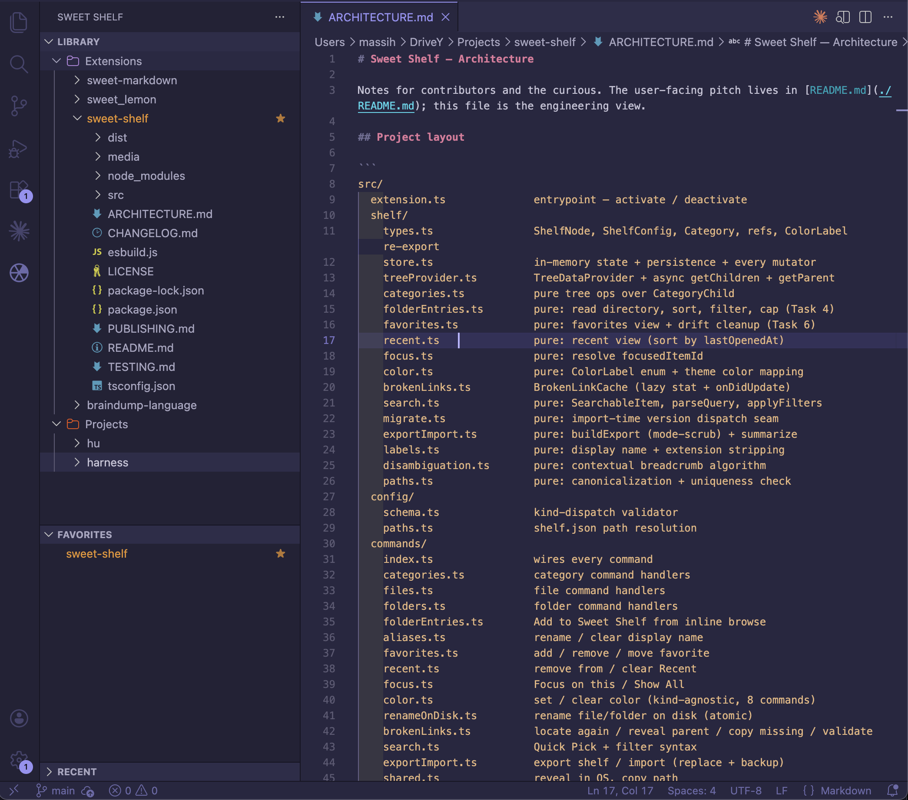

# Sweet Shelf

> Organize the files, folders, notes, and ideas you keep coming back to — all in one VS Code sidebar.



Sweet Shelf gives VS Code a personal sidebar for the files, folders, and projects you keep returning to, no matter where they live on your computer. Pin a markdown notebook from your home directory, a wiki folder from a client project, and a draft chapter from your novel folder — all in one calm, organized shelf. No more juggling five VS Code windows for five different things.

## Principles

Sweet Shelf is built on four ideas:

**Safe by default.** Sweet Shelf never deletes your real files. Removing something from the shelf only removes the shortcut — your file stays exactly where it is.

**A map, not a filesystem.** Sweet Shelf doesn't replace your file explorer. It's a layer above your scattered work that organizes it by meaning, not by where it happens to live on disk.

**Calm, human language.** "Remove from Sweet Shelf" instead of "Delete." "Rename Display Name" when you're just changing how the shelf shows it. The shelf makes it clear when an action is shelf-only versus when it touches your real files.

**One window, many notebooks.** Click a folder in the shelf and browse its contents inline — no need to open a new VS Code window for every project.

## Features

### Pin from anywhere

Add files and folders to your shelf from anywhere on disk. They sit together in your sidebar, even if they live in different folders.

### Browse without switching workspaces

Click any folder in the shelf to expand its contents inline. Open files in your current editor without losing your workspace.

### Organize by meaning

Create nested categories that match your mental model. Drag and drop to rearrange.

### Stay focused

Enter Focus Mode on any project to hide the rest of your shelf and concentrate on one thing.

### Personalize

Color-code categories. Alias confusing filenames (`README.md` becomes `Novel Overview`). Favorite the things you return to most.

### Search by keyboard

`Cmd/Ctrl + Shift + P` → "Sweet Shelf: Search Shelf" → type a few characters → jump anywhere. Supports `color:red`, `is:favorited`, `is:broken` filters for power users.

### Recover when files move

If a shelved file gets moved or deleted on disk, Sweet Shelf marks it as missing rather than crashing. Right-click → **Locate Again** to point the shelf at the new location.

### Export, import, recover

Export your shelf to JSON. Import on another machine. Sweet Shelf always backs up your current shelf before any import — your organization is portable and recoverable.

## Installation

Install **Sweet Shelf** from the VS Code Marketplace:

- Open the Extensions view (`Cmd/Ctrl + Shift + X`)
- Search for **Sweet Shelf**
- Click **Install**

Or via the command line:

```bash
code --install-extension sweet-lemon.sweet-shelf
```

## Getting started

1. Click the **Sweet Shelf** icon in the Activity Bar (left edge of VS Code)
2. Click the **+** button to create your first category — call it whatever fits how you think (`Books`, `Wikis`, `Clients`, `Daily notes`)
3. Right-click your category → **Add File** or **Add Folder** to pin items from anywhere on your computer
4. Click any folder to browse its contents inline; click any file to open it

That's the whole loop. Build out categories as you go.

## Search

Run **Sweet Shelf: Search Shelf** from the Command Palette to fuzzy-find anything on your shelf — display names (alias-aware), real filenames, breadcrumb paths, category names. Type a few characters, hit Enter, you're there.

Power-user filters at the start of the query:

- `color:red` (any of the seven colors) — only items with that color label
- `is:favorited` — only favorited items
- `is:broken` — only items whose paths are missing

Filters compose: `color:red is:favorited novel` finds red, favorited items matching "novel". Filters parse only at the start of the query and vanish from the input once recognized so the rest of what you type fuzzy-matches normally.

## Export, import, recover

**Sweet Shelf: Export Shelf** writes a JSON file you can keep, share, or move to another machine. Two modes:

- **Shelf structure (recommended)** — categories, files, folders, aliases, colors, favorites, focus, ordering. Strips usage history. Best for sharing your organization with another machine or person.
- **Everything (including usage history)** — full state, faithful round-trip. Best for migrating to a new machine while keeping your Recent list intact.

**Sweet Shelf: Import Shelf** replaces your current shelf with the contents of a JSON export. Before replacing anything, your current shelf is backed up to `shelf.json.pre-import-<timestamp>.bak` in the same directory as your live config. The success toast offers a "Reveal Backup" button so you can recover with one click if the import was wrong.

**Sweet Shelf: Reveal Config File** opens `shelf.json` in your OS file manager (Finder / Explorer / file manager) for power-user inspection or hand-editing.

## Settings

| Setting                               | Default  | What it does                                                                                                                                            |
| ------------------------------------- | -------- | ------------------------------------------------------------------------------------------------------------------------------------------------------- |
| `sweetShelf.confirmRemoveCategory`    | `true`   | Show a confirmation dialog before removing a non-empty category. Real files are never affected.                                                         |
| `sweetShelf.defaultFileClickAction`   | `open`   | What happens when you click a file (`open` or `openToSide`).                                                                                            |
| `sweetShelf.defaultFolderClickAction` | `browse` | What happens when you click a folder. `browse` expands inline (recommended). `openInCurrentWindow` and `openInNewWindow` change your VS Code workspace. |
| `sweetShelf.showHiddenFiles`          | `false`  | Show dotfiles when browsing folders inline.                                                                                                             |
| `sweetShelf.showFileExtensions`       | `true`   | Show file extensions in shelf labels. Aliases always show as typed.                                                                                     |
| `sweetShelf.maxRecentItems`           | `20`     | Cap on the Recent section (1–100).                                                                                                                      |

## Commands

Discoverable in the Command Palette as `Sweet Shelf: …`:

- **Add File** / **Add Folder** — pin from disk
- **New Category** — create a top-level category
- **Search Shelf** — keyboard-driven fuzzy find across the shelf
- **Validate Paths** — re-check every shelved path for missing files
- **Clear Recent** — wipe the Recent list (your real files are unaffected)
- **Show All** — exit Focus Mode (only visible while focused)
- **Export Shelf** / **Import Shelf** — JSON portability
- **Reveal Config File** — open `shelf.json` in your OS file manager

The right-click menus on the tree carry the per-item actions: rename, color, favorite, focus, locate again, remove, and so on.

## Privacy

Sweet Shelf stores its config locally in VS Code's global storage directory. Nothing leaves your machine. The shelf knows about file paths but doesn't read file contents (except for VS Code's normal file-opening when you click a file).

## Contributing

See [ARCHITECTURE.md](./ARCHITECTURE.md) for the engineering view of the project, [TESTING.md](./TESTING.md) for the manual smoke-test sequence, and [PUBLISHING.md](./PUBLISHING.md) for the release flow.

## License

[MIT](./LICENSE)
